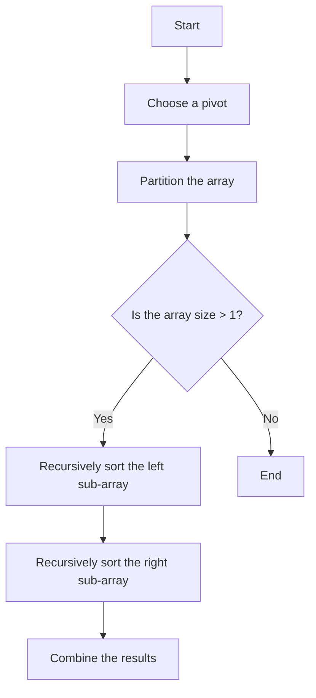
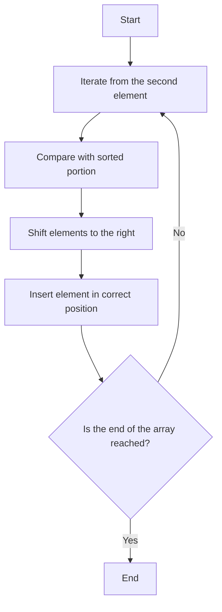
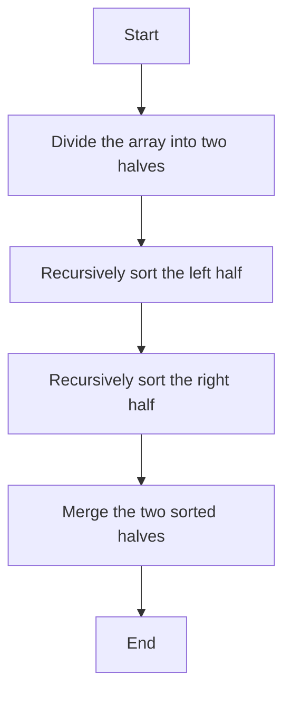

# Sorting Algorithms Documentation

## Quick Sort

### Description
Quick Sort is a divide-and-conquer algorithm. It works by selecting a 'pivot' element from the array and partitioning the other elements into two sub-arrays, according to whether they are less than or greater than the pivot. The sub-arrays are then sorted recursively.

### Pseudocode
1. Choose a pivot element.
2. Partition the array into two sub-arrays: elements less than the pivot and elements greater than the pivot.
3. Recursively apply the above steps to the sub-arrays.

### Flowchart


## Insertion Sort

### Description
Insertion Sort is a simple sorting algorithm that builds the final sorted array one item at a time. It is much less efficient on large lists than more advanced algorithms such as quicksort, heapsort, or merge sort.

### Pseudocode
1. Iterate from the second element to the end of the array.
2. For each element, compare it with the elements in the sorted portion of the array.
3. Shift elements that are greater than the current element to the right.
4. Insert the current element into its correct position.

### Flowchart


## Merge Sort

### Description
Merge Sort is a divide-and-conquer algorithm that was invented by John von Neumann in 1945. It divides the input array into two halves, calls itself for the two halves, and then merges the two sorted halves.

### Pseudocode
1. Divide the array into two halves.
2. Recursively sort the two halves.
3. Merge the two sorted halves.

### Flowchart


## Run Test

### Compile
```bash
gcc -o test_sorting_algorithms src/sort/test_sorting_algorithms.c src/sort/quick_sort.c src/sort/insertion_sort.c src/sort/merge_sort.c src/sort/sort_utils.c
```

### Run
```bash
./test_sorting_algorithms
```
